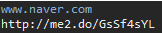

## [NAVER Service API](https://developers.naver.com/products/shortenurl/)
 
`download`  [gson-2.8.5.jar](https://mvnrepository.com/artifact/com.google.code.gson/gson) 

`
Java Build Path - Libraries - Add JARs - gson-2.8.5.jar
`

> ##### 결과 출력

